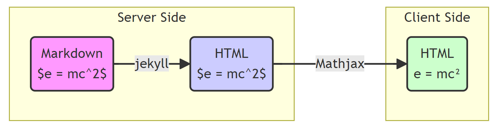

# Math Expressions in Markdown Using MathJax and Jekyll

## Introduction

This tutorial demonstrates how to seamlessly integrate mathematical expressions into your Markdown documents using MathJax and Jekyll. This powerful combination allows you to write complex mathematical notation using LaTeX syntax within your Markdown files, which are then beautifully rendered on your website.

Whether you're creating a technical blog, documenting scientific research, or building an educational platform, this setup provides a clean, efficient way to present mathematical content on the web.

[Skip to Setup](#setup)

## Technical Jargon
1. Jekyll: static site generator written in ruby
2. Mathjax: Javascript library that serves as the render engine for mathematical functions
3. Kramdown: Markdown Flavour written in ruby(a ruby library for parsing and converting a superset of markdown)
4. LaTex: Document preparation system that helps with typesetting 
5. Tex: renders LaTeX locally unlike Mathjax that render on the webpage

## Steps


## Setup

To get started with using MathJax in your Jekyll-powered GitHub Pages site, follow these steps:

1. **Create a GitHub repository**
   - Go to GitHub and create a new repository (e.g., "math-examples").

2. **Set up Jekyll**
   - Clone the repository to your local machine.
   - In the root of your repository, create a file named `_config.yml` with the following content:

     ```yaml
     theme: jekyll-theme-cayman
     markdown: kramdown
     kramdown:
       math_engine: mathjax
     ```

3. **Create your Markdown content**
   - Save your Markdown content as `index.md` in the root of your repository.

4. **Add MathJax support**
   - Create a new file named `_layouts/default.html` in your repository.
   - Copy the content of the [Cayman theme's default layout](https://github.com/pages-themes/cayman/blob/master/_layouts/default.html) into this file.
   - Add the following lines just before the closing `</head>` tag in the `default.html` file:

     ```html
     <script src="https://cdnjs.cloudflare.com/ajax/libs/mathjax/2.7.0/MathJax.js?config=TeX-AMS-MML_HTMLorMML" type="text/javascript"></script>
     <script type="text/x-mathjax-config">
       MathJax.Hub.Config({
         tex2jax: {
           inlineMath: [['$','$'], ['\\(','\\)']],
           processEscapes: true
         }
       });
     </script>
     ```

5. **Commit and push your changes**
   - Add all the files to your Git repository.
   - Commit the changes with a message like "Initial commit with math examples".
   - Push the changes to GitHub.

6. **Enable GitHub Pages**
   - Go to your repository's settings on GitHub.
   - Scroll down to the "GitHub Pages" section.
   - Under "Source", select the branch you pushed to (usually "main" or "master").
   - Click "Save".

7. **View your site**
   - GitHub will provide you with a URL where your site is published (usually in the format `https://username.github.io/repository-name/`).
   - It may take a few minutes for your site to be built and deployed.

8. **Troubleshooting**
   - If the math doesn't render correctly, double-check your `_layouts/default.html` file to ensure the MathJax script is included correctly.
   - Make sure there are no spaces between the dollar signs and the LaTeX expressions in your Markdown file.

By following these steps, you'll have a Jekyll site set up with MathJax support, allowing you to write mathematical expressions in your Markdown files using LaTeX syntax.

***Further refinements and theme settings on the way***
